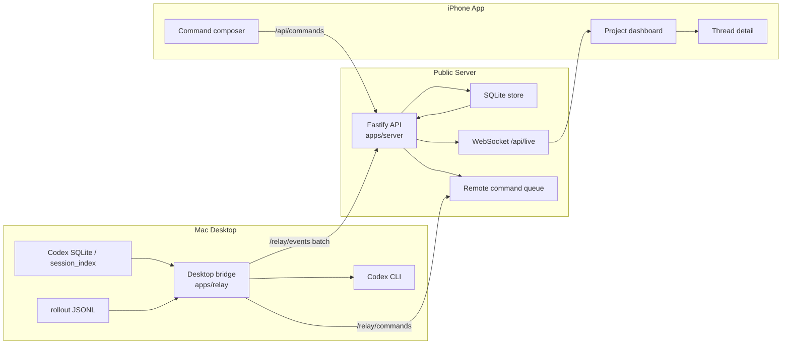
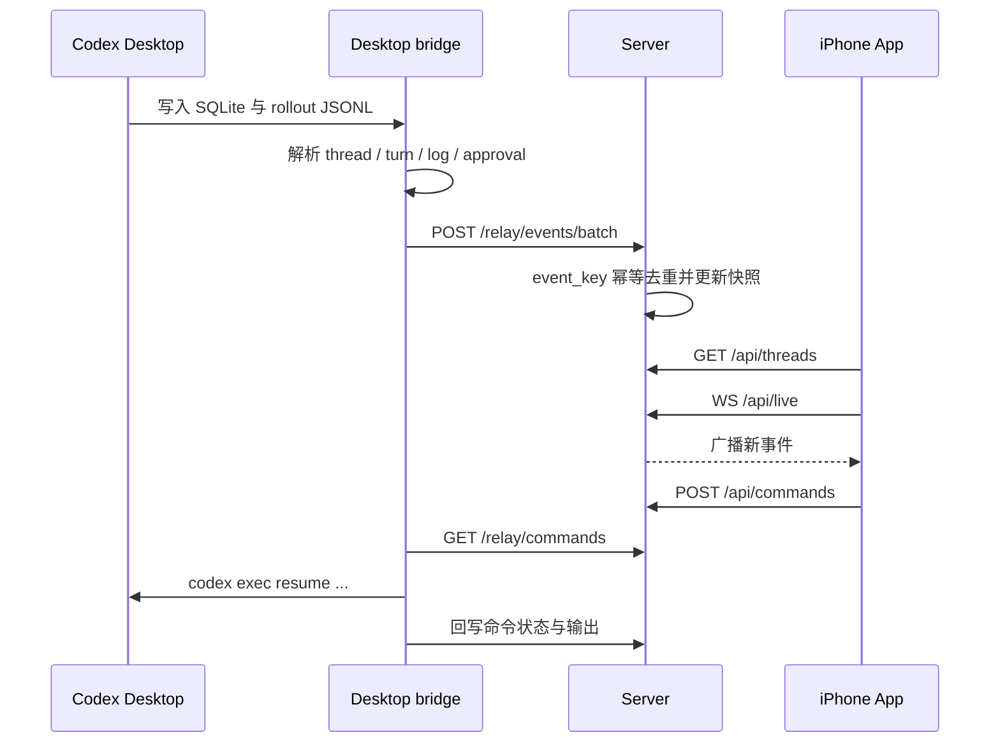
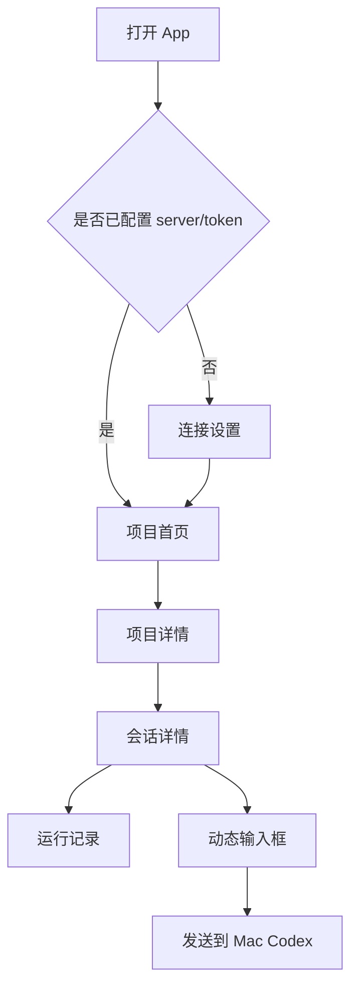
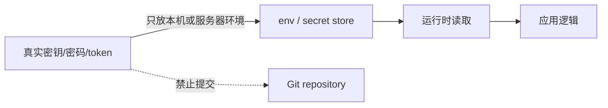

# iPhonedex

iPhonedex 是一套用于实时观察和遥控 Mac 桌面版 Codex 的 iPhone 监控系统。它把 Mac 上的 Codex 会话、运行状态、日志、审批请求和远程指令串成一条链路，让你可以在手机上查看项目、进入会话详情、跟踪 Codex 输出，并把新的指令发送回 Mac。

生产访问地址：

```text
https://www.topomotion.com/codex-monitor
```

## 功能一览

| 能力 | 说明 |
| --- | --- |
| 项目聚合 | 按 Codex 桌面会话的 `cwd` 聚合项目，过滤 subagent/worker/explorer 噪声 |
| 会话详情 | 展示用户消息、Codex 回复、思考记录、工具调用和终端输出 |
| 实时同步 | iPhone 通过 WebSocket 感知 server 事件，并自动刷新快照 |
| 历史回放 | Desktop bridge 可从 Codex rollout 文件回灌历史，server 保留最近日志窗口 |
| 远程指令 | 手机端调用 server 入队，Mac bridge 拉取后通过 Codex CLI 执行 |
| 推送通知 | 支持设备注册，为等待审批或失败状态保留通知入口 |

## 架构图



## 数据流



## 手机端体验



详情页会把相邻的 Codex 回复合并成一条可读消息，工具调用和终端输出折叠在运行记录里。输入框默认保持紧凑，会随着输入内容增长。

## 目录结构

```text
apps/
  ios/                 iPhone SwiftUI App
  relay/               Mac Desktop bridge
  server/              公网 Fastify server
  e2e/                 端到端测试
packages/
  protocol/            共享事件协议与 snapshot reducer
scripts/
  install-codex-monitor-desktop-bridge.sh
deploy/
  nginx 与生产部署辅助配置
```

## 核心接口

| 方向 | 接口 | 用途 |
| --- | --- | --- |
| Bridge -> Server | `POST /relay/events` | 上传单个事件 |
| Bridge -> Server | `POST /relay/events/batch` | 批量上传事件 |
| iPhone -> Server | `GET /api/threads` | 获取项目/会话快照 |
| iPhone -> Server | `GET /api/live` | WebSocket 实时通知 |
| iPhone -> Server | `POST /api/commands` | 手机端发送远程指令 |
| Bridge -> Server | `GET /relay/commands` | Mac 拉取待执行命令 |
| iPhone -> Server | `POST /api/devices/register` | 注册 APNs 设备 token |

## 本地开发

安装依赖：

```bash
pnpm install
```

构建与检查：

```bash
pnpm build
pnpm -r lint
pnpm --filter @codex-monitor/protocol test
pnpm --filter @codex-monitor/server test -- src/server.test.ts
pnpm --filter @codex-monitor/relay test -- src/desktop-bridge.test.ts src/index.test.ts
```

iOS 模拟器测试：

```bash
DEVELOPER_DIR=/Applications/Xcode.app/Contents/Developer \
xcodebuild test \
-project apps/ios/CodexMonitor.xcodeproj \
-scheme CodexMonitor \
-destination 'platform=iOS Simulator,name=iPhone 17'
```

指定真机构建：

```bash
DEVELOPER_DIR=/Applications/Xcode.app/Contents/Developer \
xcodebuild build \
-project apps/ios/CodexMonitor.xcodeproj \
-scheme CodexMonitor \
-destination 'id=00008101-000A29422189003A'
```

## Desktop Bridge

bridge 通过 LaunchAgent 常驻运行，读取本机 Codex 数据并同步到 server。

常用命令：

```bash
scripts/install-codex-monitor-desktop-bridge.sh status
scripts/install-codex-monitor-desktop-bridge.sh restart
```

配置文件位于：

```text
~/.codex/codex-monitor.env
```

只提交配置模板或环境变量名，不提交真实 token、密码、私钥或 APNs p8 内容。

## Server 部署

生产服务监听本机端口，再由 Nginx 暴露到公网路径：

```text
127.0.0.1:18787
/codex-monitor/
```

健康检查：

```bash
curl https://www.topomotion.com/codex-monitor/health
```

## 安全边界



安全约定：

- 不提交 token、密码、私钥、APNs p8、个人访问令牌。
- README 与示例命令只使用占位符。
- 上传事件前执行文本脱敏，server 侧对事件做幂等去重。
- 远程命令需要 server 开关、host 白名单和项目路径白名单共同允许。

## 项目状态

当前主线已覆盖：

- Codex 桌面会话按项目聚合
- 会话命名与历史日志回灌
- server snapshot 热路径缓存
- bridge 异步执行远程命令
- iPhone 详情页动态输入框、稳定滚动和回复合并
- 真机 build/install/launch 验证链路

